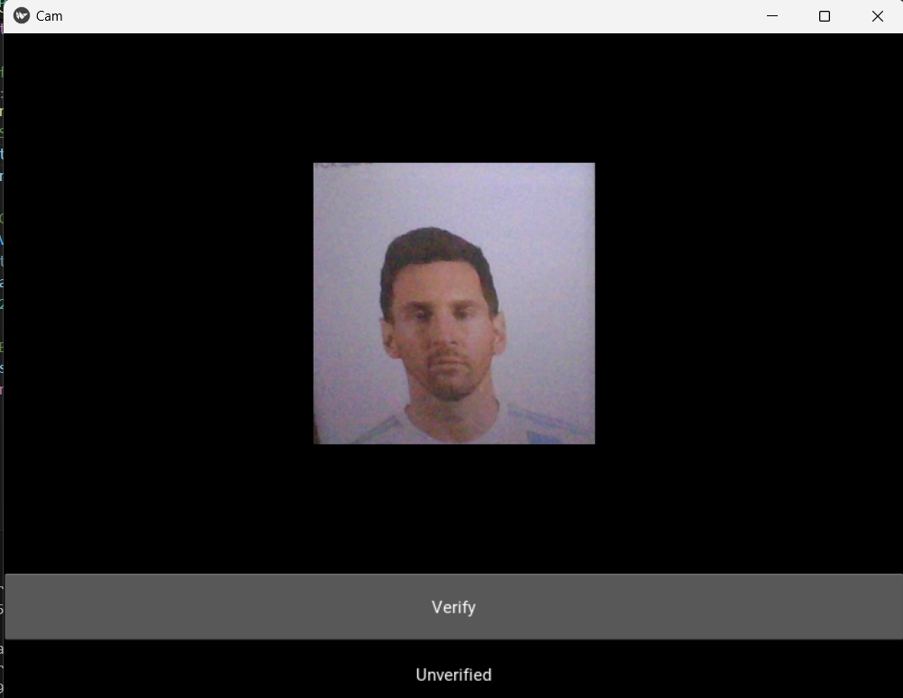

# Deep Learning Face Verification

## Overview

This project implements face verification using deep learning techniques. It utilizes a Siamese Neural Network architecture trained on a dataset containing anchor, positive, and negative images. During training, the model learns to differentiate between images of the target person (positive samples) and images of other individuals (negative samples). The trained model is then used for verification, where it compares a given input image against a set of verification images to determine whether the input image belongs to the target person or not.

## Requirements

- Python 3
- TensorFlow
- Keras
- OpenCV
- NumPy

## Usage

1. Clone the repository:

```
git clone https://github.com/srijosh/Face-Verification-Deep-Learning-.git
```

2. Install the required dependencies:

```
pip install -r requirements.txt
```

3. Run the " Facial Verification with a Siamese Network.ipynb " Jupyter Notebook file to train the model. Make sure you have enough images inside application_data/verification_images folder to test the verification

4. Once you have tested, Navigate to the `app` folder and paste the model trained h5 format file inside it

5. Run the faceid.py script inside the app folder. Ensure that you have enough images inside the app/application_data/verification_images folder for testing.

```
cd app
python faceid.py
```

## Demo:

<table width="100%"> 
<tr>
<td width="50%">

</td> 
<td width="50%">
  
</td>
</table>
